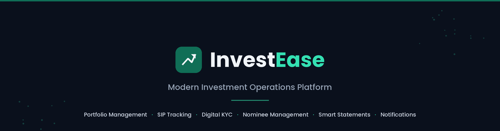
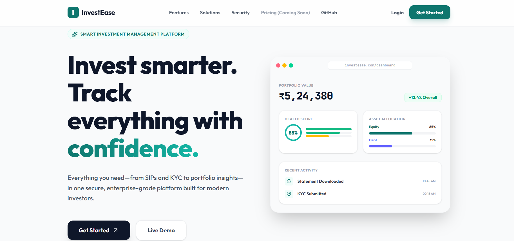
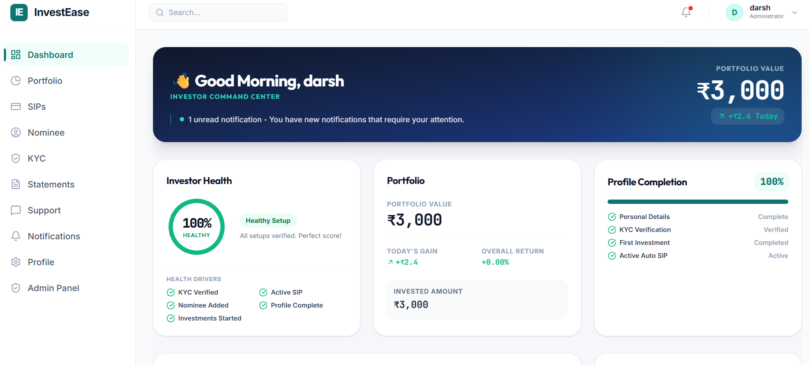
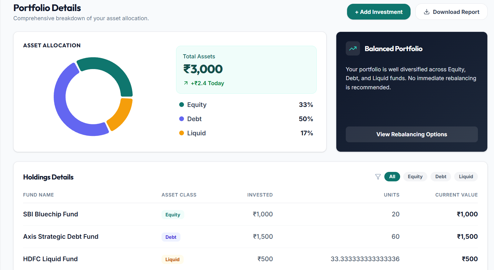
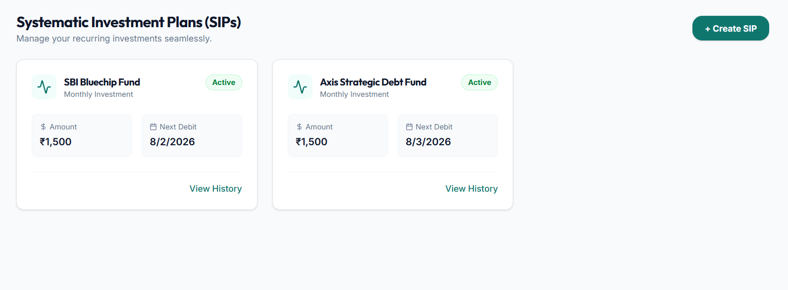
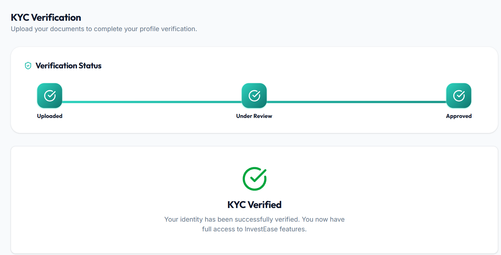
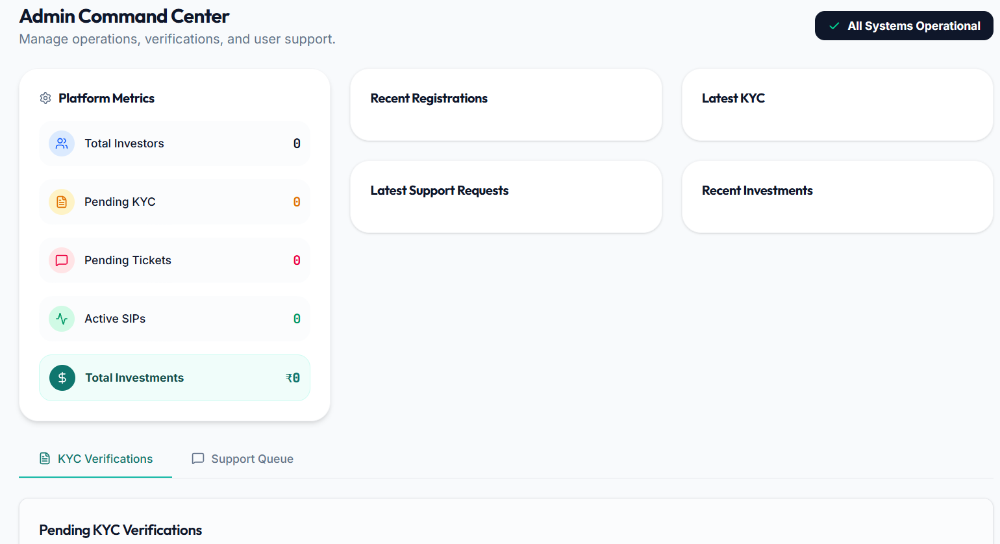
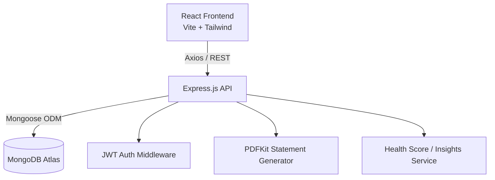

<div align="center">

<!-- Replace with an actual banner image, e.g. docs/banner.png -->


# InvestEase

**A full-stack investor self-service platform built on the MERN stack**

InvestEase lets investors manage their portfolio, SIPs, KYC, nominees, statements, and support requests from a single dashboard — and gives administrators the tools to review KYC and resolve support tickets without a separate backend tool.

[](https://react.dev/)
[](https://nodejs.org/)
[](https://expressjs.com/)
[](https://www.mongodb.com/atlas)
[](https://jwt.io/)
[](https://tailwindcss.com/)
[](https://vercel.com/)
[](https://render.com/)
[](#license)

[Live Demo](#live-demo) · [Features](#features) · [Architecture](#architecture) · [Installation](#installation) · [Full Documentation](./docs/PROJECT_DOCUMENTATION.md)

</div>

---

## Overview

InvestEase moves a set of repetitive investor support tasks — statement downloads, KYC updates, nominee changes, SIP status checks — into a secure, self-service dashboard, so those requests no longer need to go through a support agent. An admin panel closes the loop by giving operations staff a queue to review KYC submissions and resolve support tickets.

It's built as a demonstration of practical full-stack architecture: JWT authentication, role-based access control, a normalized MongoDB schema, a documented REST API, and a responsive React frontend.

> This is a portfolio/demo project. It does not connect to real mutual fund APIs, bank accounts, or live market data — all investment data is illustrative. See [design decisions](./docs/PROJECT_DOCUMENTATION.md#design-decisions) for why.

For the deep technical reference — full API docs, complete schema, sequence diagrams, and design rationale — see **[docs/PROJECT_DOCUMENTATION.md](./docs/PROJECT_DOCUMENTATION.md)**.

<details>
<summary><strong>Table of contents</strong></summary>

- [Overview](#overview)
- [Live Demo](#live-demo)
- [Screenshots](#screenshots)
- [Features](#features)
- [Highlights](#highlights)
- [Tech Stack](#tech-stack)
- [Architecture](#architecture)
- [Installation](#installation)
- [Project Structure](#project-structure)
- [Documentation](#documentation)
- [Roadmap](#roadmap)
- [Contributing](#contributing)
- [License](#license)

</details>

---

## Live Demo

| | |
|---|---|
| **Frontend** | `https://investease.vercel.app` (Example) |
| **Backend API** | `https://investease-api.onrender.com` (Example) |

<details>
<summary><strong>Demo credentials</strong></summary>

> Available after the backend has been seeded (`npm run seed`).

**Investor**
```
Email:    demo@investease.com
Password: Demo@123
```

**Admin**
```
Email:    admin@investease.com
Password: Admin@123
```

</details>

---

## Screenshots

<!-- Replace each placeholder with an actual screenshot -->

| Landing Page | Investor Dashboard |
|---|---|
|  |  |

| Portfolio | SIPs |
|---|---|
|  |  |

| KYC | Admin Dashboard |
|---|---|
|  |  |


---

## Features

**Investor**
Portfolio overview · SIP tracking with failure reasons · Digital KYC upload · Nominee management · On-demand PDF statements · Typed notifications · Support tickets

**Admin**
KYC review queue (approve/reject) · Support ticket queue · Independently enforced role restrictions

**Platform**
JWT authentication with bcrypt password hashing · Role-based access control · Investor Health Score (rule-based) · Portfolio allocation visualization · Fully responsive UI

<details>
<summary><strong>What's dynamic vs. rule-based</strong></summary>

Authentication, all CRUD operations (Portfolio, Investments, SIP, Nominee, KYC, Statements), and notifications are backed by real MongoDB data and change as the user acts. The Investor Health Score, market outlook, and portfolio insights are deterministic rule-based logic — not AI. Full explanation: [Dynamic vs. Rule-Based Features](./docs/PROJECT_DOCUMENTATION.md#dynamic-vs-rule-based-features).

</details>

---

## Highlights

**Investor Health Score**
A rule-based score summarizing account health — KYC status, active SIPs, nominee presence, profile completeness. Deliberately not investment advice; see [why it's rule-based, not AI](./docs/PROJECT_DOCUMENTATION.md#dynamic-vs-rule-based-features).

**Guided Resolution Assistant**
A deterministic decision-tree flow (e.g. "My SIP failed → was your bank account changed?") that resolves common issues before an investor needs to raise a support ticket. Honestly named — no LLM involved.

**Event-driven recompute**
Adding an investment or SIP doesn't just insert a record — it triggers a recompute chain that updates portfolio totals, allocation, and health score, then generates a notification, all within the same request. [See the flow →](./docs/PROJECT_DOCUMENTATION.md#event-driven-recompute-flow)

**Admin verification loop**
KYC approval and support ticket resolution are handled through a dedicated, independently role-protected admin queue — not just an investor-facing app with no operations side.

---

## Tech Stack

| Layer | Technologies |
|---|---|
| Frontend | React, Vite, Tailwind CSS, React Router, Axios, Recharts, Lucide Icons |
| Backend | Node.js, Express.js, JWT, bcrypt, Mongoose, Multer, PDFKit |
| Database | MongoDB Atlas |
| Deployment | Vercel (frontend), Render (backend), MongoDB Atlas (database) |

---

## Architecture



Full system architecture, the event-driven recompute flow, and every sequence diagram: **[Architecture Overview →](./docs/PROJECT_DOCUMENTATION.md#system-architecture)**

---

## Installation

### Prerequisites
Node.js 18+, npm or yarn, a MongoDB Atlas cluster (or local MongoDB).

### Quick start

```bash
git clone https://github.com/darshan02parmar/investease.git
cd investease

# Backend
cd backend
npm install
cp .env.example .env   # fill in your values
npm run seed            # populates demo investor and admin accounts
npm run dev

# Frontend (new terminal)
cd client
npm install
cp .env.example .env   # set VITE_API_URL
npm run dev
```

Frontend runs at `http://localhost:5173`, backend at `http://localhost:5000`.

**backend/.env.example**
```bash
PORT=5000
MONGO_URI=mongodb+srv://<user>:<password>@cluster.mongodb.net/investease
JWT_SECRET=replace_with_a_long_random_string
CLIENT_URL=http://localhost:5173
NODE_ENV=development
```

Full environment variable reference, MongoDB setup, and deployment steps: **[Installation & Deployment →](./docs/PROJECT_DOCUMENTATION.md#deployment)**

---

## Project Structure

```
investease/
├── backend/
│   ├── controllers/   # Request/response handlers
│   ├── services/      # Business logic
│   ├── models/        # Mongoose schemas
│   ├── routes/        # Express routes
│   ├── middleware/    # Auth, error handling
│   └── seed/          # Database seed script
├── client/
│   └── src/
│       ├── pages/       # Route-level pages
│       ├── features/    # Domain-grouped modules
│       ├── components/  # Shared UI
│       └── services/    # API layer
└── docs/                # Documentation, screenshots
```

Full folder structure with rationale: **[Project Documentation →](./docs/PROJECT_DOCUMENTATION.md#folder-structure--conventions)**

---

## Documentation

| | |
|---|---|
| **API Reference** | [docs/api_documentation.md](./docs/api_documentation.md) |
| **Database Schema** | [docs/architecture_diagrams.md#database-entity-relationship-er-diagram](./docs/architecture_diagrams.md#database-entity-relationship-er-diagram) |
| **Security Model** | [docs/PROJECT_DOCUMENTATION.md#security-model](./docs/PROJECT_DOCUMENTATION.md#security-model) |

---

## Roadmap

Email notifications · Real mutual fund data integration · Live NAV updates · AI-assisted investment guidance · Goal-based planning · Bank integration · Dark mode

Full phased roadmap: **[docs/PROJECT_DOCUMENTATION.md#future-roadmap](./docs/PROJECT_DOCUMENTATION.md#future-roadmap)**

---

## Frequently Asked Questions

<details>
<summary><strong>Is this connected to real mutual funds or bank accounts?</strong></summary>

No. InvestEase is a demo/portfolio project — all investment, NAV, and bank data is illustrative. Real market and broker integration is listed under [Future Roadmap](./docs/PROJECT_DOCUMENTATION.md#future-roadmap).
</details>

<details>
<summary><strong>Does the Investor Health Score use AI?</strong></summary>

No — it's a transparent, rule-based score. See [why that was a deliberate choice](./docs/PROJECT_DOCUMENTATION.md#dynamic-vs-rule-based-features).
</details>

<details>
<summary><strong>Can I register a new account and see real data, or is everything seeded?</strong></summary>

New accounts start empty by design — the seed script only populates the demo investor and admin accounts. Adding an investment or SIP through the UI triggers a real write and recompute chain; see [Event-Driven Recompute Flow](./docs/PROJECT_DOCUMENTATION.md#event-driven-recompute-flow).
</details>

<details>
<summary><strong>Can I use this as a starting point for my own project?</strong></summary>

Yes — it's MIT licensed. See [Contributing](#contributing) if you'd like to submit improvements back.
</details>

---

## Contributing

1. Fork the repository
2. Create a feature branch (`git checkout -b feature/your-feature`)
3. Commit with a clear message
4. Open a pull request describing what changed and why

---

## License

Licensed under the [MIT License](./LICENSE).

## Acknowledgements

[React](https://react.dev/) · [Tailwind CSS](https://tailwindcss.com/) · [Recharts](https://recharts.org/) · [MongoDB Atlas](https://www.mongodb.com/atlas) · [PDFKit](https://pdfkit.org/)

## Developer

**Darshan Parmar**
[GitHub](https://github.com/darshan02parmar)

**Pankti Parmar**
[GitHub](https://github.com/Pankti2312)


