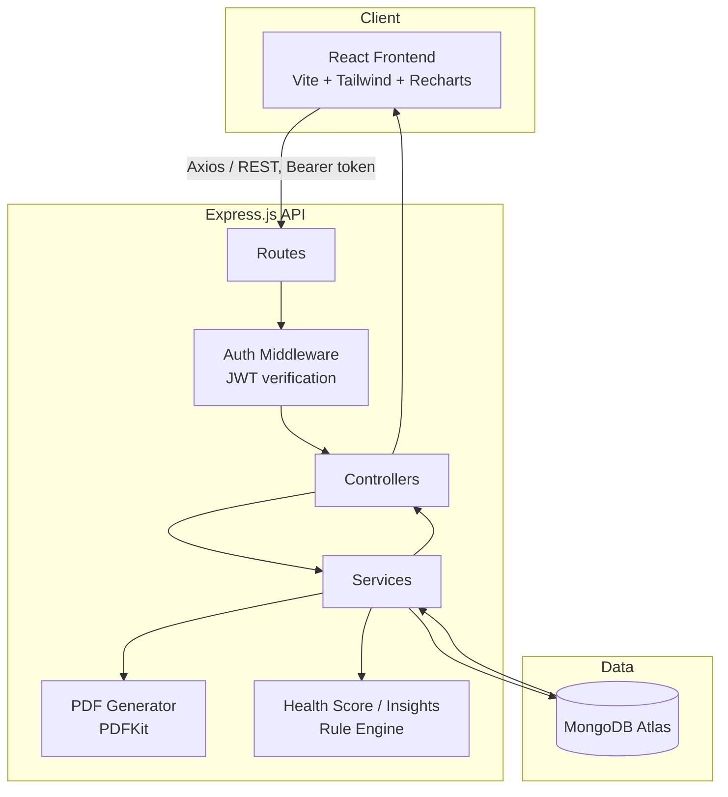
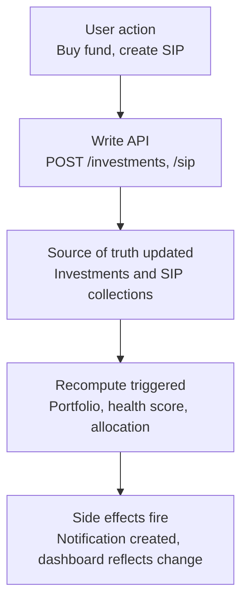
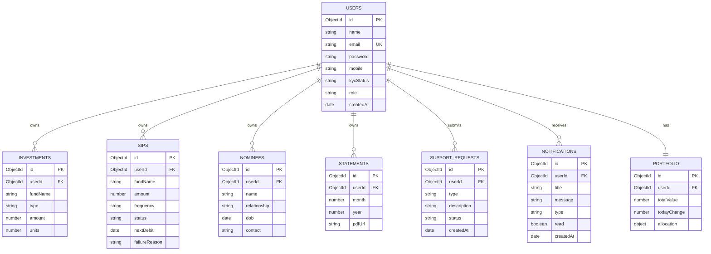
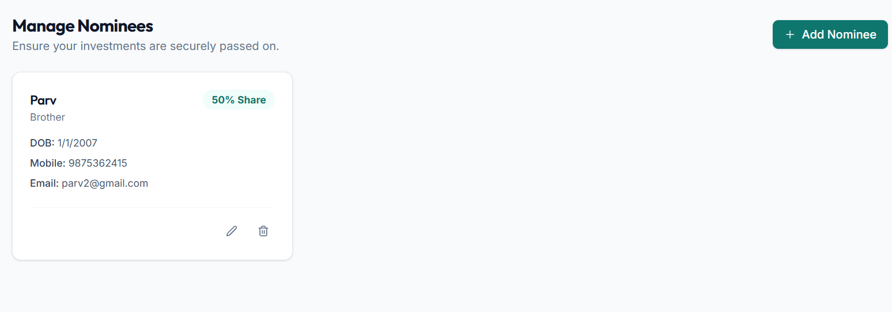
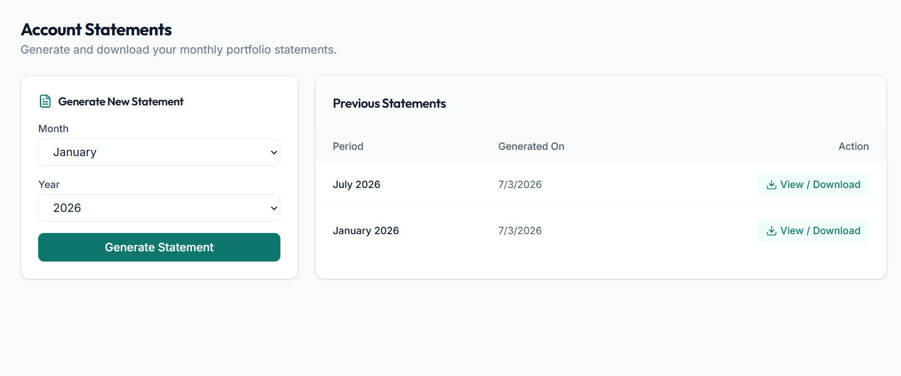
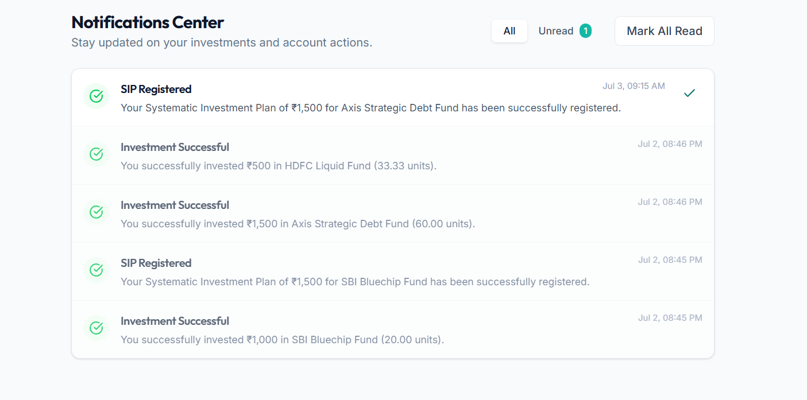
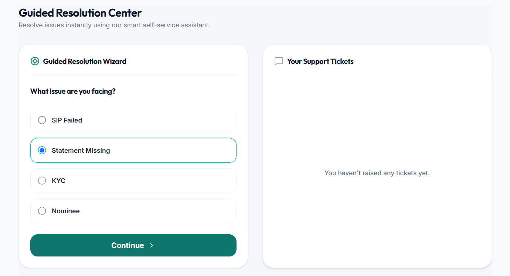

# InvestEase — Project Documentation

This is the technical reference for InvestEase. The root [`README.md`](../README.md) is the quick-start front door; this document covers everything a contributor, reviewer, or future-you would need to understand *why* the system is built the way it is, not just how to run it.

## Table of Contents

- [System Architecture](#system-architecture)
- [Database Schema](#database-schema)
- [API Documentation](#api-documentation)
- [Security Model](#security-model)
- [Performance Considerations](#performance-considerations)
- [Testing Strategy](#testing-strategy)
- [Folder Structure & Conventions](#folder-structure--conventions)
- [Deployment](#deployment)
- [Known Limitations](#known-limitations)
- [Future Roadmap](#future-roadmap)
- [Developer Notes](#developer-notes)
- [Screenshots](#screenshots)

---

## System Architecture

InvestEase follows a conventional three-tier architecture with one deliberate addition: a **recompute chain** that runs after every write, so derived values (portfolio totals, health score) never go stale.

### High-level component diagram



**Layering rule:** routes only wire HTTP verbs to controller functions. Controllers only handle request/response shape and status codes. Services hold all business logic and are the only layer permitted to touch Mongoose models directly. This is what lets the Health Score logic, for example, be called from both the dashboard endpoint and the insights endpoint without duplicating code.

### Event-driven recompute flow

Rather than storing computed fields as static values, writes to the underlying collections (Investments, SIPs) trigger a synchronous recompute chain within the same request — no message queue or event bus, which would be over-engineering at this scale.



In code, this looks like a plain sequential call chain inside the service layer:

```js
// services/investmentService.js
async function addInvestment(userId, data) {
  const investment = await Investment.create({ userId, ...data });
  await recalculatePortfolio(userId);
  await recalculateHealthScore(userId);
  await createNotification(userId, 'investment_added', investment);
  return investment;
}
```

This keeps every derived value (portfolio total, allocation percentages, health score) accurate immediately after a write, without needing a background job or cache-invalidation strategy.

---

## Database Schema



### Collection notes

| Collection | Key fields worth noting | Indexes |
|---|---|---|
| `Users` | `role` enum: `investor` \| `admin`. `kycStatus` enum: `Pending` \| `Under Verification` \| `Approved` \| `Rejected` | `{ email: 1 }` unique |
| `Portfolio` | `allocation` is a nested object `{ equity, debt, liquid }`, recomputed on every investment write, not stored as raw input | `{ userId: 1 }` |
| `Investments` | `type` enum: `Equity` \| `Debt` \| `Liquid` — this drives the allocation calculation | `{ userId: 1 }` |
| `SIPs` | `status` enum: `Active` \| `Paused` \| `Failed`. `failureReason` is only populated when `status: 'Failed'`, and its enum values map 1:1 to the messages shown by the Guided Resolution Assistant | `{ userId: 1 }` |
| `Notifications` | `type` enum drives the icon/color mapping in the frontend rather than a switch statement per component | `{ userId: 1, createdAt: -1 }` (compound, supports sorted recent-first queries) |
| `Requests` (support) | `status` enum: `Submitted` \| `In Progress` \| `Completed` | `{ userId: 1, createdAt: -1 }` |

---

## API Documentation

The complete API documentation, including request/response examples and endpoints for all modules, is maintained in its own dedicated reference file.

**See [API Documentation Reference](./api_documentation.md)**

---

## Security Model

- **Password hashing** — bcrypt, cost factor 10, plain-text passwords never stored or logged.
- **JWT** — payload limited to `{ userId, role }`; no PII in the token since it's base64-decodable by anyone holding it. Short expiry (hours, not infinite).
- **Protected routes** — enforced independently on frontend (UX) and backend (actual security boundary) — the frontend check alone is never trusted.
- **Role-based authorization** — middleware checks `req.user.role` server-side on every admin route.
- **File upload validation** — Multer `fileFilter` restricts KYC uploads to `image/jpeg`, `image/png`, `application/pdf`, capped at 5MB, rejected before hitting disk.
- **Rate limiting** — applied specifically to `/auth/login` to reduce brute-force risk.
- **CORS** — locked to the deployed frontend origin, not `*`.
- **Input validation** — validated on both client (immediate feedback) and server (source of truth) — never trusted from the client alone.
- **Environment variables** — `.env` gitignored, `.env.example` committed with placeholder values only.

---

## Performance Considerations

- `.lean()` used on all read-only Mongoose queries, particularly the dashboard aggregation, to skip full document hydration.
- Indexes on every `userId` field, plus compound indexes on fields that are sorted (e.g. `{ userId: 1, createdAt: -1 }` on Notifications and Requests).
- Dashboard payload assembled with `Promise.all` so independent lookups (Portfolio, SIP, KYC, Notifications) run concurrently rather than sequentially.
- Generated PDF statements are cached — a statement for a closed month is generated once and reused, not regenerated on every download click.
- Frontend uses TanStack Query for request caching and de-duplication; route-level code splitting keeps the Admin Panel and PDF-related bundles out of the initial investor-facing load.

---

## Testing Strategy

Given limited time, testing priority follows this order:

1. Auth flow (register/login/protected route) — everything downstream depends on this.
2. Dashboard aggregation endpoint — the most complex query and most visible on failure.
3. KYC status state-machine transitions — the easiest place to accidentally allow an invalid transition.
4. Guided Resolution Assistant tree traversal — tested end-to-end for at least two full paths (e.g. the SIP-failure flow).
5. PDF generation — including the edge case of a month with no recorded activity yet.

Postman/Thunder Client collections are used to validate backend endpoints independently before wiring the frontend to them.

---

## Folder Structure & Conventions

```
investease/
├── backend/
│   ├── config/         # DB connection, environment setup
│   ├── controllers/    # Req/res handling only — no business logic
│   ├── middleware/     # Auth, role checks, centralized error handler
│   ├── models/         # Mongoose schemas
│   ├── routes/         # Route → controller wiring only
│   ├── services/       # All business logic lives here
│   ├── utils/
│   ├── validators/
│   ├── seed/            # Seed script for demo data
│   └── server.js
├── client/
│   └── src/
│       ├── assets/
│       ├── components/  # Shared, presentational UI
│       ├── layouts/     # AppLayout (sidebar+navbar), AuthLayout
│       ├── pages/        # Route-level composition
│       ├── features/     # One folder per domain (auth/, dashboard/, kyc/...)
│       ├── hooks/         # One hook per data need, wrapping React Query
│       ├── services/      # Thin Axios wrappers, one file per domain
│       ├── context/        # AuthContext
│       ├── utils/
│       └── routes/          # ProtectedRoute, AppRoutes
└── docs/
```

**Convention: one API file per domain, one hook per data need.** `services/kycApi.js` is a thin Axios wrapper; `hooks/useKyc.js` wraps it in `useQuery`/`useMutation` and owns loading/error state. Components never call `axios` directly.

**Git strategy:** `main` (production) ← `develop` (integration) ← `feature/*` branches. No direct pushes to `main`.

---

## Deployment

| Layer | Platform | Notes |
|---|---|---|
| Frontend | Vercel | Points `VITE_API_URL` at the Render backend |
| Backend | Render | Environment variables set in the Render dashboard, not committed |
| Database | MongoDB Atlas | IP access list configured; connection string in `MONGO_URI` |

Deployment order: provision the Atlas cluster → deploy the backend to Render → deploy the frontend to Vercel → update the backend's CORS allowlist to include the live frontend origin → smoke-test the full flow against the live URLs.

---

## Known Limitations

- Investment and SIP data is currently seeded for the demo account rather than reflecting a real brokerage connection — see [Design Decisions](#design-decisions) for why real market/broker integration is out of scope for this version.
- No real-time push for notifications; the frontend polls on an interval rather than using WebSockets.
- JWTs cannot currently be revoked before expiry (no server-side denylist).
- Guided Resolution Assistant currently covers a limited set of flows (e.g. SIP failure); broader coverage is planned incrementally.

---

## Future Roadmap

**Near-term**
- Email notifications for account and SIP events
- WebSocket-based real-time notifications
- Broader Guided Resolution Assistant flow coverage (KYC rejection, statement issues)

**Mid-term**
- Integration with real mutual fund data APIs and live NAV updates
- Goal-based investment planning
- Deeper portfolio analytics and risk scoring

**Long-term**
- AI-assisted investment guidance — a deliberate, explicit replacement for the current rule-based insights layer, not a rebrand of it
- Bank account integration for real SIP execution
- Dark mode

---

## Developer Notes

- When adding a new feature module, follow the existing pattern end-to-end: Mongoose model → service functions → controller → route → frontend API wrapper → hook → page/component. Skipping the service layer for "just this one small feature" is how the layering discipline erodes.
- The recompute chain (Portfolio → Health Score → Notification) is called synchronously within the request that triggers it. If a future feature needs to trigger recompute from multiple different write paths, consider extracting it into a single `onInvestmentChanged(userId)` function rather than duplicating the call chain at each call site.
- Seed data (`backend/seed/seed.js`) is meant to make the demo account fully populated on first run — if you add a new collection, extend the seed script so the demo experience doesn't regress.

---

## Screenshots

| Landing Page | Investor Dashboard |
|---|---|
|  |  |

| Portfolio | SIPs |
|---|---|
|  |  |

| KYC | Admin Dashboard |
|---|---|
|  |  |

| Nominee | Statements |
|---|---|
|  |  |

| Notifications | Support |
|---|---|
|  |  |
